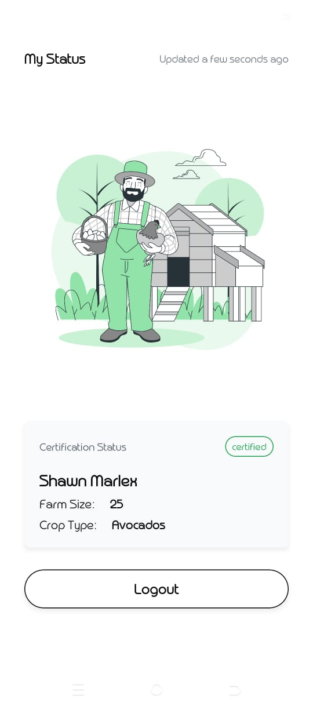
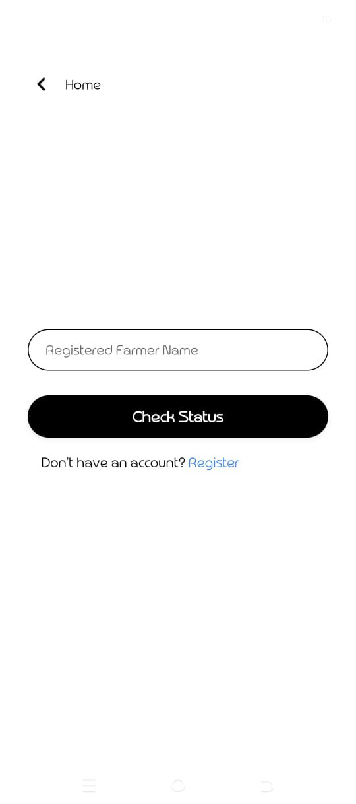
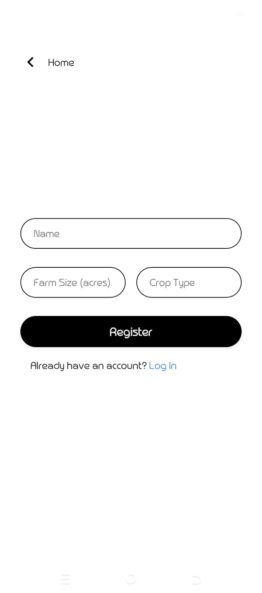

# Farmer Certification App (React Native / Expo)

This is a React Native (Expo) mobile application built as part of a take-home assignment.  
The app demonstrates a simple certification workflow between **farmers** and an **admin**.

---

## 🚀 Features

### Farmer

- Register with basic details (name, farm size, crop type)
- Log in using registered name
- View certification status
- See when their status was last updated (relative time)

### Admin

- View list of registered farmers
- Approve or reject farmer certification
- Status updates are reflected instantly on the farmer side

---

## 🧱 Tech Stack

- **React Native (Expo)**
- **TypeScript**
- **Expo Router** for file-based navigation
- **Redux Toolkit** for state management
- **AsyncStorage** for local persistence
- **NativeWind (Tailwind CSS)** for styling

---

## 📂 App Architecture

- Global state (Redux) manages:
  - Current user role
  - Registered farmers
  - Current logged-in farmer
- Data is persisted using AsyncStorage and restored on app launch
- Routing decisions are handled at the layout level using Expo Router

---

## ▶️ Running the App

1. Install dependencies

```bash
npm install
```

2. Start the app

```bash
npx expo start
```

### 📸 Screenshots

1. Role Selection Page
   

2. Admin Dashboard
   

3. Farmer Certification View
   

4. Login Page
   

5. Registration Page
   
